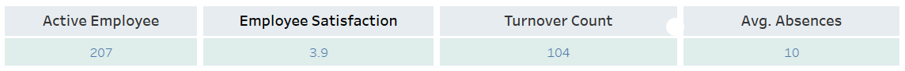
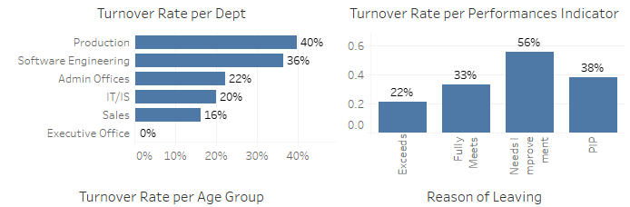
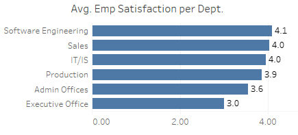
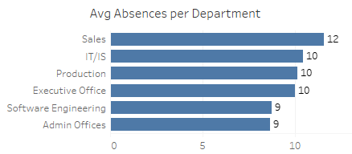
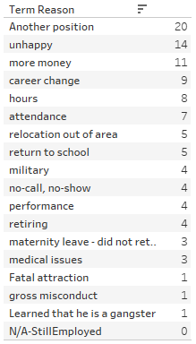

# 👥 Human Resources in Industry: A Visualization Dashboard

**Visualization Dashboard**: [Tableau](https://public.tableau.com/app/profile/larasati.syarafina/viz/HRAnalysisDashboard-Pacmann/Dashboard1?publish=yes)

**Dataset**: [Pacmann - HR Data](dataset_hr_analytics.xlsx)

## 🌟 Background
* Departemen HR pada perusahaan menerima keluhan dari manajerial bahwa terdapat banyak karyawan yang resign dari perusahaan.
* Tingkat turnover karyawan yang tinggi mengakibatkan meningkatnya workload untuk karyawan aktif dan menurunnya produktivitas karyawan.
* Selain itu, perusahaan akan membutuhkan cost lebih banyak untuk biaya perekrutan dan pelatihan karyawan baru yang dibutuhkan sebagai pengganti karyawan yang telah resign dari perusahaan.
* Dilakukan survey internal untuk menganalisis data human resource terkait karyawan yang bekerja di perusahaan tersebut.

## 🌟 Business questions
1. Bagaimana kondisi ketenagakerjaan di perusahaan secara umum? 
2. Bagaimana  kondisi turnover rate berdasarkan departemen? 
3. Bagaimana kondisi turnover rate berdasarkan kategori/skor performa? 
4. Bagaimana proporsi turnover berdasarkan kelompok usia? 
5. Apa alasan resign yang paling dominan? 
6. Bagaimana rata-rata absen berdasarkan departemen? 
7. Bagaimana rata-rata kepuasan pegawai berdasarkan departemen?

## 🌟 Data Analytics
Dalam menganalisis masalah ini, terdapat beberapa metrik yang dapat digunakan.

### 📋 Active Employee Count
Total karyawan yang aktif adalah 217 orang
### 📋  Turnover Rate
* Employee Turnover Rate atau tingkat resign karyawan dapat dihitung dengan menghitung jumlah karyawan yang resign, dibagi dengan jumlah karyawan di awal dan akhir periode yang dibagi dua, kemudian dikali 100. Dari perhitungan ini, dibuat grafik untuk menunjukkan perbandingan tingkat resign antar departemen, tingkat resign per indikator performa, dan tingkat resign berdasarkan kelompok umur.
* Jumlah karyawan yang telah resign adalah sebanyak 107 orang.

* Jika dibandingkan berdasarkan kelompok umur, karyawan yang berumur 30 hingga 50 tahun lebih banyak turnover dibandingkan karyawan yang berumur lebih dari 50 tahun.

* Departemen dengan tingkat resign paling tinggi adalah departemen Production dengan rate 40%, diikuti dengan departemen Software Engingeering dengan rate 36%. Sementara itu, terdapat departemen yang dapat tetap mempertahankan seluruh karyawannya yaitu departemen Executive Office dengan rate 0%. Sebagai karyawan eksekutif, tanggung jawab yang dimiliki akan lebih besar dibandingkan karyawan biasa, sehingga keputusan resign akan menjadi lebih sulit untuk dilakukan para karyawan di departemen eksekutif. Gaji yang lebih besar dan status yang lebih stabil juga dapat menjadi alasan karyawan eksekutif dapat mempertahankan posisinya.
* Berdasarkan indikator performa, alasan terbanyak terkait turnover karyawan adalah kebutuhan untuk improvement dari pribadi para karyawan. Hal ini dapat disebabkan karena workload yang monoton atau tidak berkembang, sehingga para karyawan berpikir untuk mencari suasana baru dengan melakukan resign.
### 📋  Employee Satisfaction
Employee Satisfaction dapat diketahui dengan melakukan survey tingkat kepuasan karyawan terhadap pekerjaan dan lingkungan kerja. Dapat dilakukan survey internal dengan skala 1-10 atau 1-100 atau dengan menghitung Employee Satisfaction Index (ESI) yang memiliki skala 1-10. Pertanyaan yang diajukan dalam ESI dapat berupa,
- Seberapa puaskah Anda dalam tempat kerja Anda (1-10)?
- Seberapa baik tempat kerja Anda memenuhi harapan Anda (1-10)?
- Seberapa dekat termpat kerja Anda dalam pekerjaan ideal Anda (1-10)?

Rata-rata skor dari seluruh pertanyaan dibagi 3 kemudian dikurangi 1, lalu dibagi 9 dan dikali 100 untuk mendapatkan rate. Hasil dari perhitungan ini adalah tingkat kepuasaan terhadap pekerjaan dan lingkungan kerja dari seluruh karyawan berjumlah 3.9%. Tingkat ini cukup rendah untuk tingkat kepuasaan suatu perusahaan, sehingga dapat mengakibatkan
- Meningkatnya potensi terjadinya absensi karyawan
- Meningkatnya potensi turnover karyawan
- Meningkatnya potensi kehilangan karyawan terbaik

Departemen yang memiliki rata-rata ESI paling rendah adalah Departemen Software Engineering berupa 4.1%, diikuti Sales dan IT/IS dengan rate 4.0%.

### 📋  Absence Rate
Employee Absenteeism Rate (tingkat ketidakhadiran karyawan) dihitung dengan menjumlah hari absen karyawan, dibagi hari kerja yang tersedia dalam periode tertentu, lalu dikali 100. 

Total rata-rata absen karyawan pada perusahaan adalah sebanyak 10 hari, dengan departemen Sales memiliki jumlah absensi terbesar yaitu sebanyak 12 hari.
Tingkat absensi yang tinggi dapat mengakibatkan
- Menurunnya produktivitas perusahaan dikarenakan kekurangan tenaga kerja
- Peningkatan biaya untuk membayar biaya lembur karyawan lain
### 📋  Term Reason

Berdasarkan hasil survey, alasan dominan mengapa karyawan memilih untuk resign adalah adanya ketertarikan dengan posisi lain. Alasan terbanyak selanjutnya adalah tidak bahagia, kebutuhan finansial, perubahan karir, dan seterusnya.

## 🌟 Summary & Recommendations
Survey internal yang telah dilakukan menghasilkan analisis terkait kemungkinan faktor tingginya turnover rate yakni
* Kurangnya peluang untuk pertumbuhan dan pengembangan dalam pekerjaan dan lingkungan kerja.
* Harapan yang tidak realistis tentang pekerjaan, beban kerja terlalu berat, target terlalu idealis.
* Work life unbalance.

Solusi yang dapat ditawarkan untuk mengatasi masalah ini adalah
* Mengadakan suatu program baru terkait pengembangan karyawan, seperti pengembangan skill yang dibutuhkan masing-masing departemen.
* Memperbaiki scope pekerjaan menjadi lebih realistis dan lebih tergapai dalam periode yang ditargetkan.
* Mengimplementasikan program fleksibilitas waktu kerja.

